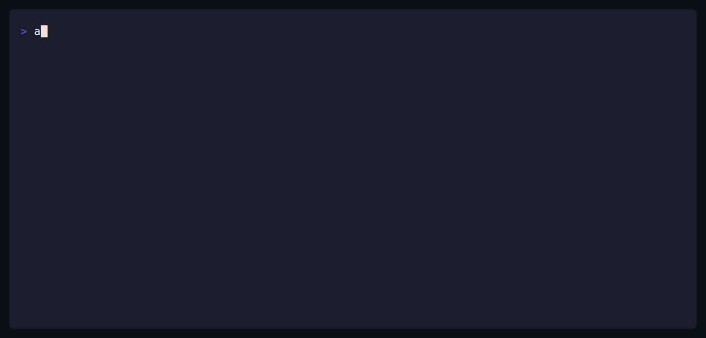
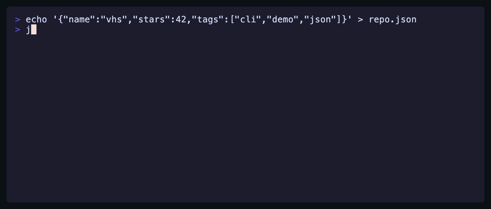

# autotape

**Point autotape at any CLI repo — get a README-ready demo GIF.**

It reads your `--help`, scripts your tool's single best interaction as a [VHS](https://github.com/charmbracelet/vhs) tape, renders it deterministically, then reviews its own GIF frame-by-frame and fixes what looks wrong. You don't get a video you're stuck with — you get an editable `.tape` draft you can tweak and re-render.

<p align="center">
  
</p>

> That GIF is autotape recording itself: inside the recording, an agent writes a tape, VHS renders it, and the frame-by-frame self-review passes. The 2-minute agent wait is hidden with `Wait+Screen` — exactly the kind of edit autotape makes for you.

## Example

Run against `jq`, untouched output:

<p align="center">
  
</p>

The deliverable is not just the GIF — it's the [tape draft](./docs/examples/jq-demo.tape) you can tweak and re-render:

```tape
Hide
Type `echo '{"name":"vhs","stars":42,"tags":["cli","demo","json"]}' > repo.json`
Enter
Show
Type `jq '{name, stars, first_tag: .tags[0]}' repo.json`
Enter
Sleep 3s
```

**More:** the [gallery](./docs/gallery/) — bat, eza, fd, glow, gum, hyperfine, ripgrep, tokei — every GIF one command, zero manual editing, each with its editable tape next to it.

## Install

```sh
npm install -g autotape   # or: npx autotape
```

`autotape` itself is pure Node — the postinstall step just checks whether `vhs`, `ttyd`, and `ffmpeg` are on your `PATH` and prints the right install command if not (`brew install vhs` covers all three on macOS/Linuxbrew). No binaries are silently downloaded.

The default agent driver shells out to [Claude Code](https://claude.com/claude-code) (`claude -p`). Template mode (`--agent none`) needs no agent at all.

## Usage

```sh
autotape .                              # auto-detects the CLI from package.json bin
autotape path/to/repo --cmd "mytool"    # or tell it how to invoke the tool
autotape lint demo.tape                 # lint any VHS tape against the measured rules
```

| Flag | Meaning | Default |
|---|---|---|
| `--cmd "<command>"` | how to invoke the CLI | auto-detected |
| `--profile hero\|tui` | single-command hero shot vs full-screen TUI | auto-detected |
| `--agent claude\|codex\|none` | who writes the tape body | `claude` |
| `--try "<command>"` | example invocation for `--agent none` | — |
| `--pr` | 10s budget (PR comment) instead of 20s (README) | off |
| `--no-review` | skip the frame-by-frame self-review | off |
| `--out <dir>` | output directory | `./autotape-out` |

Outputs: `demo.gif`, `demo.tape` (editable draft), `README-snippet.md`, `review.json`.

## How it works

1. **Analyze** — reads your README and `--help` output, and decides whether the tool is a one-shot command or a full-screen **TUI** (from framework mentions and a keybindings table). A TUI switches to the `tui` profile and its keybindings are pulled out for the next step.
2. **Write** — an agent scripts the *single most impressive interaction* as a tape body: one command-and-output for a CLI, or a launch-then-navigate walkthrough driven by the extracted keys for a TUI. Settings come from the profile, not the model.
3. **Lint** — deterministic rules check (and auto-fix) the draft before a single frame is rendered.
4. **Render** — VHS records the tape. Same tape in, same GIF out, every time.
5. **Review** — frames are extracted with ffmpeg and read back by a vision model: error text, blank frames, cut-off output, leaked usernames, or a broken demo send the tape back to step 2 with specific feedback.

The subjective part (what to show) is compressed into a small text artifact you can edit; everything after it is deterministic. Cost per run: two small model calls.

Both shapes are in the [gallery](./docs/gallery/) — eight one-shot CLIs plus an [htop TUI walkthrough](./docs/gallery/htop/demo.tape).

## The taste engine

Nothing here is tuned by eye — profiles and lint thresholds are measured from real, published VHS tapes (distributions in [`data/extracted-defaults.json`](./data/extracted-defaults.json)).

| Measured | Finding | autotape default |
|---|---|---|
| FontSize | two clusters: 22–28 (hero) vs 14–16 (TUI) | 26 / 16 |
| Dimensions | 1500×640-ish hero, 1600×900+ TUI | per profile |
| TypingSpeed | 90–100ms in every polished tape | 100ms |
| Total sleeps | well-made tapes: 3–17s | ≤20s budget (≤10s `--pr`) |
| GitHub blend | `Margin 20` + `MarginFill "#0d1117"` + `BorderRadius 10` | on for hero |
| Cursor | `CursorBlink false` | on |
| Setup | wrapped in `Hide`/`Show` | lint error if visible |

`autotape lint` enforces these on any tape, generated or hand-written. Two rules exist because real tapes broke without them: VHS strings have **no escape sequences** (`\"` is a parse error — autotape re-delimits with backticks), and VHS allows **multiple commands per line** (`Sleep 2s Show`), which the parser handles token-wise.

## Roadmap

- **GitHub Action** — re-render the GIF on every release so the demo never rots.
- **web-tape** — the same pipeline pointed at web apps through a declarative browser DSL.
- **Codex driver hardening** — `--agent codex` exists but is lightly tested.

## License

MIT
