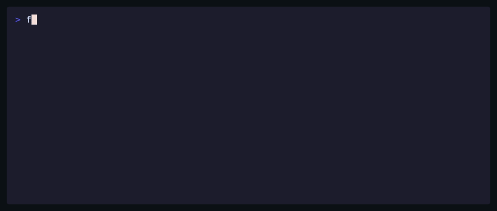
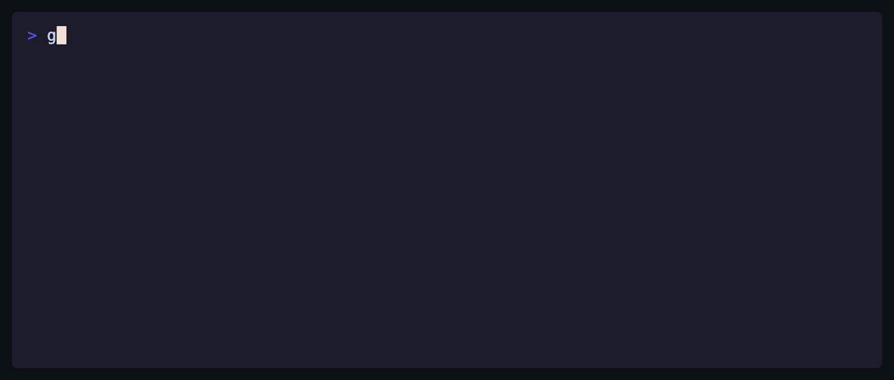
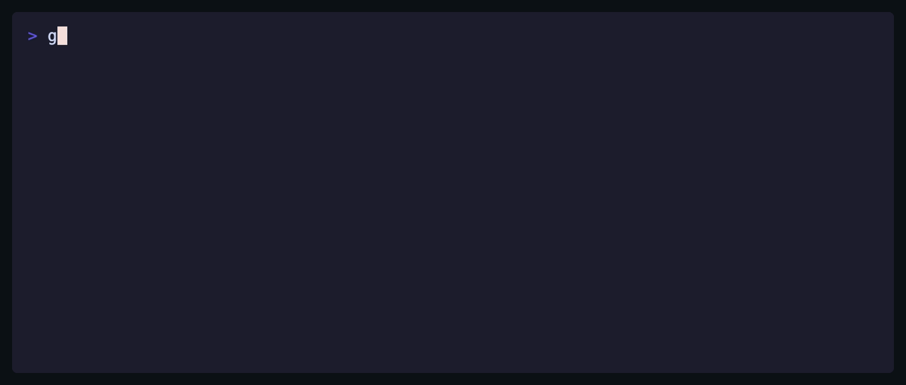
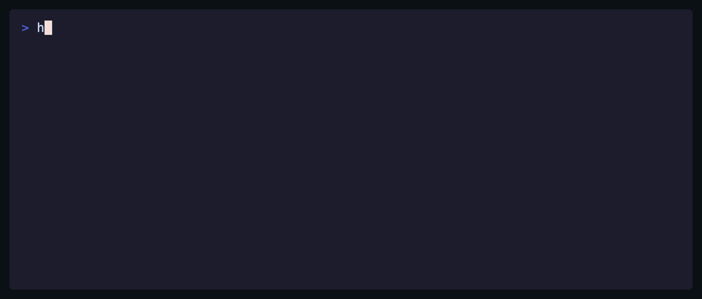
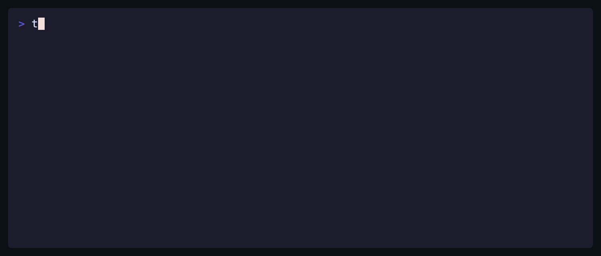

# Gallery

Every GIF below was generated by a single command — `autotape <dir> --cmd <tool>`.
The agent wrote each tape, the linter enforced the measured conventions, VHS
rendered it, and a frame-by-frame review approved it. Next to each GIF sits the
editable `.tape` draft it came from. (One human edit total: eza's draft gained
`--no-user` and was re-rendered with `vhs demo.tape` — exactly the
tweak-the-tape workflow the drafts are for.)

| | |
|---|---|
| **bat** — [tape](./bat/demo.tape)  | **eza** — [tape](./eza/demo.tape)  |
| **fd** — [tape](./fd/demo.tape)  | **glow** — [tape](./glow/demo.tape)  |
| **gum** — [tape](./gum/demo.tape)  | **hyperfine** — [tape](./hyperfine/demo.tape)  |
| **ripgrep** — [tape](./rg/demo.tape)  | **tokei** — [tape](./tokei/demo.tape)  |

Also: [jq](../examples/jq-demo.gif) (in the main README) and [autotape itself](../demo.gif) — recorded by autotape, of course.

Working directory for all runs: a small sample project (`main.py`, `server.ts`,
`data.json`, `README.md`) so the tools have something pretty to chew on.
